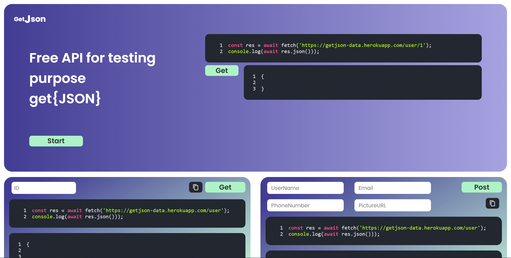

[<h1 style="font-size:60px; width:100%;">GetJson</h1>](./appicon.png)

# 🗒️Free API Provider for Testing Purpose🗒️

## Running On:
## Client:
[<h2>https://getjson.netlify.app</h2>](https://getjson.netlify.app)

## API:

[<h2>https://getjson-data.herokuapp.com/user</h2>](https://getjson-data.herokuapp.com/user)

## UI:
[</img>](interface/Home.png)

## How to run Locally:

### Server:
1. Directory `GetJson`
2. create `.env.development` file and add your own variable value included in `.env.example`
3. Run `yarn` to install all packages
4. Run `yarn dev` to run the server

### React:
1. Directory `GetJson/client`
2. create `.env.development` file and add your own variable value included in `.env.example`
3. Run `yarn` to install all packages
4. Run `yarn dev` to run the server

## Technology Use:
1. ReactJS
2. NodeJS
